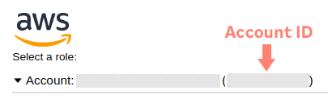

To create a cluster using the declarative approach:

1. Create a declaration and edit it to suit your needs
2. Apply the declaration


## Commands

To scaffold a cluster declaration, run the following:

```bash
# Usage
okctl scaffold cluster > PATH

# Example
okctl scaffold cluster > cluster.yaml
```

To create a cluster based on the declaration, run the following:

```bash
# Usage
okctl apply cluster -f PATH

# Example
okctl apply cluster -f cluster.yaml
```

## Details

The declarative approach does exactly the same as `okctl create cluster` used to do, except that it gets all its user 
input up front. That way you can easily take down and recreate clusters as you experiment. You create a declaration once
and apply it as many times as you need.

## Usage

When running 

```bash
okctl scaffold cluster > cluster.yaml
``` 

you'll end up with a file looking like this:

```yaml
apiVersion: okctl.io/v1alpha1
kind: Cluster

# For help finding values, see https://okctl.io/getting-started/create-cluster
metadata:
  # Account ID is your AWS account ID
  accountID: '123456789123'
  # Environment is the name you use to identify the type of cluster it is. Common names are production, test, staging
  environment: development
  # Name can be anything, but should define the scope of the cluster. Meaning if the cluster is scoped to one product,
  # you might want to name it the name of the product. If the cluster contains all services and products owned by a
  # team, the team name might be more fitting.
  name: my-product-name
  # Region defines the AWS region to prefer when creating resources
  # region: eu-west-1

# The cluster root URL defines the domain of which to create services beneath. For example; okctl will setup ArgoCD
# which has a frontend. The frontend will be available at https://argocd.<clusterRootURL>. For Cognito it will be 
# https://auth.<clusterRootURL>
clusterRootURL: my-product-name-development.oslo.systems

# For okctl to be able to setup ArgoCD correctly for you, it needs to know what repository on Github that will contain
# your infrastructure.
github:
  # The name of the repository
  repository: my_iac_repo_name
  # The organization that owns the repository
  # organisation: oslokommune
  # The folder to place infrastructure declarations
  # outputPath: infrastructure

integrations:
  # ArgoCD is a service that watches a repository for Kubernetes charts and ensures the defined resources are running
  # as declared in the cluster
  argoCD: true
  # Autoscaler automatically adjusts the size of pods and nodes in your cluster depending on load
  autoscaler: true
  # AWS Load Balancer Controller handles routing from the internet to your application running inside your okctl
  # Kubernetes cluster. If you want your applications and services accessible from the internet, this needs to be
  # enabled.
  awsLoadBalancerController: true
  # Block storage provides persistent storage for your cluster (Persistent Volumes)
  blockstorage: true
  # Cognito is an authentication provider that okctl uses to control access to different resources, like ArgoCD and
  # Grafana
  cognito: true
  # External DNS handles defining the necessary DNS records required to route traffic to your defined service or 
  # application
  externalDNS: true
  # External Secrets fetches secrets from external sources and exposes them as native Kubernetes secrets inside the
  # cluster 
  externalSecrets: true
  # KubePromStack enables Prometheus and Grafana for metrics
  kubePromStack: true
  # Loki collects logs and exposes them as a data source in Grafana
  loki: true
  # Promtail scrapes logs from pods and feeds them to Loki
  promtail: true
  # Tempo collects traces and exposes them as a data source in Grafana. Supports formats like jaeger, zipkin, open 
  # telemetry
  tempo: true

## okctl creates a Virtual Private Cloud for you which it organizes all the intended resources that require networking.
## A VPC is mandatory, but can be configured by the following attributes.
#vpc:
#  # CIDR defines the VPC IP range. Leave this be if you don't know what it is/does
#  cidr: 192.168.0.0/20
#  highAvailability: true
```

Modify the declaration to suit your situation and needs, then use

```bash
okctl apply cluster -f cluster.yaml
```

to have okctl generate a cluster based on the declaration.

That's it. Sit back and enjoy or go do something else while `okctl` does its thing (can take up to an hour).

## Authentication

### Device authentication flow

For `okctl` to be able to interact with Github on your behalf, `okctl` needs do something called the
`Device Authentication flow`. 

In the beginning of the cluster creation process, `okctl` will ask you to enter a code in
a browser window. The code will be presented. Copy it and press `Y` and `enter`. `okctl` will open a window in your 
browser where you can enter the code. 

Copy the code highlighted in red and press `Y` and then `enter`


Paste it into the newly opened tab in your browser


Press the green "Authorize oslokommune" button


That's it! You are all set. Switch back to the console and enjoy `okctl` creating your cluster for you.

### AWS 

In some cases it can be useful to use a service user for authentication. 

By passing the flag `--aws-credentials-type access-key` to `okctl apply cluster`, `okctl` will look for the following
environment variables to be used to authenticate.
* `AWS_ACCESS_KEY_ID`
* `AWS_SECRET_ACCESS_KEY`

Example
```shell
export AWS_ACCESS_KEY_ID=myid
export AWS_SECRET_ACCESS_KEY=mykey

okctl apply cluster --aws-credentials-type access-key -f cluster.yaml
```

### Github

In some cases it can be useful to use a service user for authentication.

By passing the flag `--github-credentials-type token` to `okctl apply cluster`, `okctl` will look for the following
environment variable to be used to authenticate.
* `GITHUB_TOKEN`

Example
```shell
export GITHUB_TOKEN=mytoken

okctl apply cluster --github-credentials-type token -f cluster.yaml
```

## Where do I find this declaration attribute?

### AccountID

Go to https://login.oslo.kommune.no/auth/realms/AD/protocol/saml/clients/amazon-aws
Log in as you usually do - find account id as shown here:
<span style="display:block;text-align:center"></span>

### Environment

The name of the environment depends on what the cluster will be used for. Examples being:
* production
* development
* staging

Basically anything you want.

### Repository

Go to your infrastructure as code (IAC) repository, and find the name of the repository in the top left corner. It
should look something like this: `oslokommune/<repository name>`

<span style="display:block;text-align:center"></span>

It will be the part after the `/`.

### Team

* Go to: https://github.com/orgs/oslokommune/teams
* Search for your team name, for example search for "kjøremiljø"
* Copy the text after @oslokommune/<team>. This is your team name (in this case kjoremiljo)

<span style="display:block;text-align:center"></span>

## Any other attribute

If you don't know what it does, default is probably fine.
