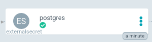

# Okctl reference app
*Guide from zero to running with a reference application*

This guide will give you a complete example for how to set up a reference application in an okctl environment. It can be useful
to see how various part are configured together and help gain a better understandning for how you configure your own application.

Following this guide will set up:

* A running reference application in a new or existing cluster
* Postgres database for the application (RDS)
* A Persistent volume claim ([PVC](https://aws.amazon.com/premiumsupport/knowledge-center/eks-persistent-storage/)) for the application 


## Get your cluster ready
Use an existing cluster or, [set up a new cluster](https://okctl.io/getting-started/create-cluster/).

If setting up a new cluster, these are the lines you need to change. If using an existing cluster, make sure it has a database.

```yaml
accountID: '123456789123' #set to your own AWS account id
...
   name: my-cluster-name # The name of your cluster, IE okctl-reference-dev
...
 clusterRootDomain: my-cluster-name.oslo.systems # your oslo.system sub-domain
...
   repository: my_iac_repo_name #your iac repo name IE okctl-reference-iac
...
 users:
 - email: user.email@emailprovider.org #your email
   # name, namesapce and username do not have to be the same, but it should be the same as you chose for
   # production, since it will make the configuration much more straight-forward later
 databases:
   postgres:  
   - name: okctlreference
     namespace: okctlreference
     user: okctlreference
```

## Add application to cluster
We are going to apply the following [app](https://github.com/oslokommune/okctl-reference-app). You also have a look at the [iac repository](https://github.com/oslokommune/okctl-reference-iac), and the application [running](https://app.okctl-reference.oslo.systems/) in our cluster.
You don't have to look at the app source code or iac repository to continue this guide.

You can copy the yaml below into a file, or use `okctl scaffold application` and edit values manually, when you have yaml file ready you can [apply your application](https://okctl.io/getting-started/create-application/).

```yaml
apiVersion: okctl.io/v1alpha1
kind: Application

metadata:
   # A name that identifies your app
   name: okctl-reference-app
   # The Kubernetes namespace where your app will live
   namespace: reference

# The Docker image containing the application. image.uri and image.name is mutually exclusive. Either specify the URI or
# define a name of an ECR repository for which okctl will create for you.
image:
   # uri defines where the image can be pulled from
   uri: ghcr.io/oslokommune/okctl-reference-app:v0.0.29

# The subdomain of the URL your app should be available on
# Example in a cluster with okctl-reference.oslo.systems as root cluster URL (as defined by primary DNS zone in the
# cluster declaration):
#
# subDomain: okctl
# result: okctl.okctl-reference.oslo.systems
# Comment this out to avoid setting up an ingress, in other words - avoid exposing it on the internet
#
subDomain: app

# The port your app listens on
# Comment this out to avoid setting up a service (required if url is specified)
#
port: 8080

# Enable prometheus scraping of metrics
prometheus:
   path: /metrics

# Enable integration with a Postgres database
postgres: okctlreference

# Volumes to mount
volumes:
   - /okctl/reference/storage: # Requests 1Gi by default
```

## Setup application user in database
1. Create a temporary secret directory in your iac repo, add it to gitignore (so you don't accidentally push it). Finally generate your new password in a file. You can delete this when you are done, but you will need it in later steps of this guide.
```bash
mkdir secret && echo secret/* >> .gitignore && \
cd secret && uuidgen | sed 's/-//g' > password.secret
```

2. Go to AWS console -> Systems manager -> Parameter store - > Click Create parameter
    * Name : `/okctl/<cluster-name>/<app-name>/db_password`
    * Description : `Database password for app user`
    * Set type to 'Secure string'
    * Copy content from the `password.secret` file generated in the first step into the Value box
    * Click Create parameter
3. Create an external secret in you iac repo:
    * Create file `my-iac-repo/infrastructure/applications/<app-name>/overlays/<cluster-name>/postgres-external-secret.yaml`
    * Add the following code to it, remember to change cluster name, app name (and region if applicable):
    ```yaml
    apiVersion: 'kubernetes-client.io/v1'
    kind: ExternalSecret
    metadata:
      name: postgres
    spec:
      region: eu-west-1
      backendType: systemManager
      data:
        - key: /okctl/<cluster-name>/<app-name>/db_password
          name: db_password
    ```
    * Add a line to file, so the last three lines looks like the example below `my-iac-repo/infrastructure/applications/<app-name>/overlays/<clsuter-name>/kustomization.yaml`
    ```yaml
    resources:
    - ../../base
    - postgres-external-secret.yaml
    ```
    * Git commit and push
    * You can go to ArgoCD and confirm that the secret is now available:
      

4. Forward postgres to your local machine, and create a new user
    * First create a password file, if you read the code there is some information hidden in there, the following commands assume you are back in the root of your iac repository and that you have followed the guide to this point:
    ```bash
    echo $(uuidgen | sed 's/-//g') > secret/tmp.password
    ```
    * Now forward postgres: Use your own cluster definition file (-c), and the name of your database -n, **the username (-u) should not exist in the database already**:
    ```bash
    okctl forward postgres -c <cluster-name>.yaml -n okctlreference \
    -u tempuser -p secret/tmp.password
    ```
    * Run the following script (copy and paste the whole thing) to generate sql we will use to insert into your database
    ```bash
    password=$(cat secret/password.secret) && \
    read -p "Enter appuser name [appuser]: " username && \
    username=${username:-appuser} && \
    cat << EOF > secret/newuser.sql
    -- Same as create role with option 'login', and set a password
    create user $username with password '$password';
  
    -- this depends on app usage
    alter role $username with inherit; -- note, inherit means inherit privileges, not role stuff (createrole, createdb, etc)
    alter role $username with createrole;
    alter role $username with nocreatedb;
    -- this depends on app usage
    grant all privileges on all tables in schema public to $username;
    EOF
    ```
  
    * Add the user to your database, make any changes to sql if applicable

      **NOTE**: You need to have postgres client (psql) [installed on local machine](https://www.compose.com/articles/postgresql-tips-installing-the-postgresql-client/) for this script to work.
    ```bash
    read -p "Enter database name [okctlreference]: " database && \
    database=${database:-okctlreference} && \
    export PGPASSWORD=$(cat secret/tmp.password) && psql -h localhost -U tempuser $database < secret/newuser.sql
    ```
  
    * Finally clean up the secrets you have temporarily stored on your machine
    ```bash
    rm -rf secret
    ```

## Setup environment variables and security context in you app

Add the following to `infrastructure/applications/<app-name>/base/deployment.yaml`:
```yaml
spec:
 securityContext:
    fsGroup: 1001
containers:
...
   env:
     - name: PVC_PATH
       value: "/okctl/reference/storage/myfile.txt" # Normally you would link a directory, but we only use one file in this example
     - name: DB_NAME
       value: okctlreference
     - name: DB_USERNAME
       value: appuser
```
[View example in context](https://github.com/oslokommune/okctl-reference-iac/blob/110aee763ffa0d812330eeccd748a99fbe54d6cd/infrastructure/applications/okctl-reference-app/base/deployment.yaml)

Replace content in `infrastructure/applications/<app-name>/overlays/<cluster-name>/deployment-patch.json` with the code-block below. You need to use the appropriate value for endpoint to your own database, that can be found under RDS -> DB instances - > (your database):
```json
[
    {
        "op": "add",
        "path": "/spec/template/spec/containers/0/image",
        "value": "ghcr.io/oslokommune/okctl-reference-app:v0.0.29"
    },
    {
        "op": "add",
        "path": "/spec/template/spec/containers/0/env/3",
        "value": {
            "name": "DB_PASSWORD",
            "valueFrom": {
                "secretKeyRef": {
                    "name": "postgres",
                    "key": "db_password"
                }
            }
        }
    },
    {
        "op": "add",
        "path": "/spec/template/spec/containers/0/env/4",
        "value": {
            "name": "DB_ENDPOINT",
            "value": "okctl-reference-dev-okctlreference.c7d1uu67i7fm.eu-west-1.rds.amazonaws.com"

        }
    }
]
```

Also, pay attention to the number at the end of each env variable in the path. Since env is *one* array, you need to start counting from *after* common env variables defined in deployment.yaml.
Since deployment.yaml specifies 3 env variables (index 0, 1 , 2) we start counting from 3.

Finally, in your iac repository:
```bash
git commit -m "Setup environment for reference app" && git push
```

*This concludes this guide, good luck!*
